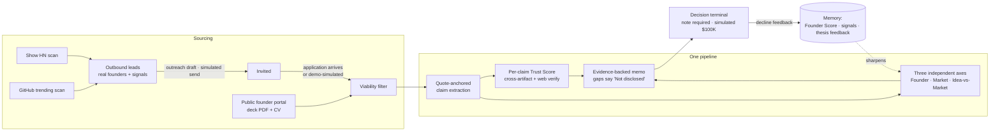

<div align="center">

# 🎯 Scopos

### The AI Operating System for Venture Capital

**Sourcing → Screening → Diligence → Decision** — a $100K invest/pass
recommendation an investor can act on within **24 hours**, for **any** founder,
including cold-start founders with no track record.

Built for **“The VC Brain: Deploying $100K Checks in 24 Hours”** —
Hack-Nation 6th Global AI Hackathon · Challenge 02 · Maschmeyer Group × MIT Clubs of Northern California & Germany

[Feature inventory](FEATURES.md) · [Manual test script](TESTING.md) · [Dataset justification](docs/DATA.md) · [Challenge brief](docs/The-VC-Brain.docx.pdf)


</div>

---

## 🎬 Demo

| | |
|---|---|
| 📱 **Mobile triage preview — clip 1** | [`docs/media/triage-swipe-1.mp4`](docs/media/triage-swipe-1.mp4) — the mobile-first `/triage` swipe card on a strong deal: three independent axes, thesis match, next action (repo mp4s are click-to-play on GitHub) |
| 📱 **Mobile triage preview — clip 2** | [`docs/media/triage-swipe-2.mp4`](docs/media/triage-swipe-2.mp4) — the same swipe card on a **cold-start** deal: wider uncertainty, lower thesis fit, still first-class |
| 📺 **Product walkthrough video** | 🚧 *Coming soon — drop `demo-walkthrough.mp4` into `docs/media/` (or attach via the GitHub editor so it embeds inline)* |
| 🖥️ **Live link** | 🚧 *Coming soon — one-click backend deploy via [`render.yaml`](render.yaml), then set `VITE_API_BASE_URL` in Lovable (steps in [Deploy](#-deploy-live-link))* |

## 📸 Screenshots

| Dashboard — the loading dock | Trust Radar — contradiction caught |
|---|---|
|  |  |
| Live funnel metrics, two pipelines (Decision-Ready / Outreach), wishlist, rule-gate Thesis Match | The $1.2M-ARR claim genuinely contradicted by the submitted artifact — 10% trust, quote attached |

| Receipts — agentic traceability | Founder Memory — the Founder Score |
|---|---|
|  |  |
| Every pipeline step logged: model, one-line summary, duration | Per-person, persistent, transparent components — survives across companies, never resets |

| Decisions — review & audit | |
|---|---|
|  | Every simulated decision with its required note; decided deals leave the pending funnel |

## 🧠 What Scopos does

The challenge: *“Imagine running the world's largest Shark Tank for AI
innovation… find them first, understand what they're capable of, and back them
before the rest of the world catches on.”* Scopos is that system — one funnel
where discovered founders and inbound applicants converge, every claim is
evidence-checked, and a decision-ready memo lands inside the 24-hour window.



## ✅ Challenge scorecard (MVP requirements from the brief)

| # | Brief requirement | Scopos | Status |
|---|---|---|---|
| 1 | **Founder Score** — a credit score for founders; persists, never resets; one input to every decision | Per-person score with transparent point components, history timeline, repeat-founder bonus; feeds the Founder Axis as ONE labeled input | ✅ Live |
| 2 | **Data Management** — collect, validate, structure heterogeneous data | Append-only signal store (decks, CVs, HN posts, repos, feedback); dedup by email→handle; PDF text extraction; idempotent migrations | ✅ Live |
| 3 | **Multi-Attribute Reasoning** — complex natural-language queries | NL search: one LLM parse → criteria chips → deterministic scorer with match % / why / missing | ✅ Live |
| 4 | **Inbound** — apply with deck + name minimum; fast first-pass screen | Public portal (company + founder + deck), server-side PDF parsing, two-tier screening (zero-cost deterministic pre-screen → LLM viability filter), live stepped progress → receipts | ✅ Live |
| 5 | **Outbound** — Identify · Activate · Converge, one funnel | Real HN + GitHub scans create leads; outreach drafts (sends simulated); convergence runs the full inbound pipeline on the same founder | ✅ Live (converge demo-labeled) |
| 6 | **Multi-Axis Screening** — three independent axes, never averaged, with trends | Founder / Market (Bullish·Neutral·Bear, no numeric score) / Idea-vs-Market; trends from real version comparison | ✅ Live |
| 7 | **Evidence-backed memos & Trust Score** — every claim traces to evidence; flag contradictions | Quote-anchored claims (no quote → no claim), per-claim 0–100 Trust Score, cross-artifact + Tavily verification, contradictions forced into memo risks, gaps say “Not disclosed” | ✅ Live |
| 8 | **Investor-grade UX** — Notion-approachable, Bloomberg-deep | Dark-navy design system, metrics hero, filters everywhere, judge-facing captions, mobile triage | ✅ Live |

**Stretch goals**

| Stretch | Scopos | Status |
|---|---|---|
| Agentic Traceability — cite the exact data point behind every conclusion | Receipts tab: full step-level trace (model, summary, ms) + per-claim source quotes | ✅ Live |
| Self-Correction Loops — validator against external evidence | External web verification with name-collision, self-quote and rounding guards; “absence ≠ contradiction” enforced in code | ✅ Live (partial — no market-database cross-reference) |
| Sourcing & Network Intelligence — model the sourcing graph | Channel chips + per-channel source labeling today | 🚧 Coming soon |

**Evaluation-criteria alignment**: Data Architecture & Intelligence 30% → quote-anchored memory + honest gaps · Analysis & Trust 25% → per-claim Trust Radar · Investment Utility 30% → 24h clock, signal→decision metrics, decision terminal · UX 15% → see screenshots.

## 🔍 The machinery judges should poke at

- **Cold-start founders are first-class** (the brief's explicit warning): no track record → CV/writing footprint assessment with a wider-uncertainty note — see deals `quiet-systems`, `fieldnote-bio`.
- **Seeded contradictions are caught, not scripted** — `metricflow` / `securestack` carry deck-vs-artifact conflicts the checker must genuinely find (and did; see the Trust tab).
- **Decline-feedback loop**: a decision note that contradicts the system's read is stored against the active thesis and injected into future scoring — “feeds back into Memory to sharpen future scoring.”
- **Degrade-not-500**: every LLM call retries then lands in the deal's `errors` field.
- **Simulated ONLY where honesty demands it**: outreach sends, the $100K decision, demo auth, lead-application convergence — all labeled in the UI.

## 🗂 Repository layout

| Path | What it is |
|---|---|
| `app/` | FastAPI backend — pipeline, trust radar, memos, leads, metrics |
| `frontend/` | The Scopos web app (TanStack Start + shadcn; mirrored from the Lovable-managed `venture-mind-os` repo via `scripts/sync-frontend.sh`) |
| `docs/` | Planning docs, challenge brief PDF, `DATA.md`, screenshots in `docs/media/` |
| `tests/` | `python -m tests.e2e_smoke` — 46-check suite |
| `contract/` | Frozen frontend API contract the backend conforms to |

## 🚀 Run locally

```bash
# Backend — http://127.0.0.1:8000
python3 -m venv .venv && .venv/bin/pip install -r requirements.txt
cp .env.example .env            # add OPENAI_API_KEY, TAVILY_API_KEY, GITHUB_TOKEN (+ ELEVENLABS_API_KEY)
.venv/bin/python -m app.seed.demo          # justified demo dataset (live LLM run, ~20 min)
.venv/bin/python -m uvicorn app.main:app

# Frontend — http://localhost:8080  (sign in with any credentials — demo auth)
cd frontend && npm i && npm run dev

# Verify
.venv/bin/python -m tests.e2e_smoke --fast
```

## ☁️ Deploy (live link)

1. **Backend → Render**: New Blueprint Instance → point at this repo ([`render.yaml`](render.yaml)) → fill the 4 keys → deploy → open the service Shell and run `python -m app.seed.demo`. Free tier sleeps — hit `/health` ~2 min before demos.
2. **Frontend → Lovable**: set `VITE_API_BASE_URL` to the Render URL and add that origin to `CORS_ORIGINS`; the published app is at `https://venture-mind-os.lovable.app`.
3. Paste the live URL here. 🚧 *Live link: coming soon.*

## 🚧 Coming soon

- arXiv / ProductHunt / accelerator-cohort / hackathon-winner sourcing channels (chips already in the Sourcing page)
- Sourcing-graph network intelligence (stretch goal 3)
- Real authentication & real outreach delivery (simulated by design today)
- Server-side pagination · scanned-deck OCR · the product walkthrough video above

---

<div align="center">

**Product code says Scopos everywhere; planning docs under `docs/` keep the challenge-era name “VC Brain” for historical context.**

Built with FastAPI · SQLite · OpenAI Structured Outputs · Tavily · ElevenLabs · TanStack Start · shadcn/ui

</div>
